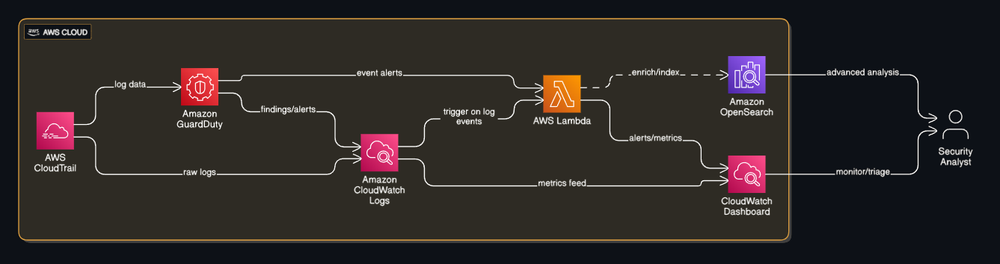

# ☁️ Cloud Threat Detection & Response Lab  
[](https://aws.amazon.com/)
[]()
[]()
[]()

> A complete serverless security monitoring and automated incident response pipeline built using AWS native services.

---

## 🧭 Overview

This project demonstrates the creation of a **Cloud Threat Detection and Automated Response System** using **AWS CloudTrail**, **Config**, **GuardDuty**, **CloudWatch**, and **Lambda**.

The goal was to simulate **real-world cloud attacks**, **detect threats**, and **automatically respond** to incidents, such as disabling compromised IAM users or blocking malicious IPs entirely through AWS automation.

---

## 🏗️ Architecture

The architecture integrates multiple AWS services in a seamless threat detection and response pipeline:

- **CloudTrail** → Logs all API calls for audit trails  
- **AWS Config** → Monitors configuration changes  
- **GuardDuty** → Detects anomalies and malicious behavior  
- **CloudWatch** → Routes alerts and triggers automated workflows  
- **Lambda** → Executes remediation actions (IAM disablement, IP blocking)  
- **S3 / OpenSearch** → Stores and visualizes logs  

### 📈 Architecture Diagram


> *CloudTrail → CloudWatch → GuardDuty → Lambda → Automated Response → Dashboard Visualization*

---

<details>
<summary>⚙️ <b>Setup Steps (Day-wise Breakdown)</b></summary>

### **🗓️ Day 1 – Core Setup**
- ✅ Created an AWS Free Tier account.  
- ✅ Enabled **CloudTrail**, **Config**, and **GuardDuty** across all regions.  
- ✅ Verified CloudTrail event logging.

### **🗓️ Day 2 – Baseline Logs**
- ✅ Launched a test **EC2 instance** and **S3 bucket**.  
- ✅ Observed **CloudTrail logs** for resource creation.  
- ✅ Checked **GuardDuty baseline findings**.  
- ✅ Captured initial dashboards.

### **🗓️ Day 3 – Simulating Threats**
- ✅ Created a new **IAM user** with `AdministratorAccess`.  
- ✅ Deleted an IAM user to generate logs.  
- ✅ Made an S3 bucket **public** (and reverted).  
- ✅ Observed new **GuardDuty findings** triggered by these actions.

### **🗓️ Day 4 – Serverless Response**
- ✅ Created **AWS Lambda function** triggered by **GuardDuty → CloudWatch Events**.  
- ✅ Implemented function to **disable risky IAM users** automatically.  
- ✅ Successfully tested the automation flow.

### **🗓️ Day 5 – Expand Automated Response**
- ✅ Wrote Lambda to **block malicious IPs** in **Security Groups**.  
- ✅ Simulated a **malicious IP alert** via GuardDuty.  
- ✅ Verified blocked IPs reflected in the Security Group rules.

### **🗓️ Day 6 – Visualization**
- ✅ Integrated **CloudTrail + GuardDuty logs** into **CloudWatch Dashboards**.  
- ✅ Created charts for:
  - Failed logins  
  - S3 misconfigurations  
  - GuardDuty findings  
- ✅ Captured final dashboard screenshots.

</details>

---

## 🧪 Testing & Validation

| Test Scenario | Expected Behavior | Result |
|----------------|------------------|---------|
| Created & deleted IAM users | CloudTrail + GuardDuty log IAM events | ✅ Detected |
| Made S3 bucket public | S3 Public Access finding in GuardDuty | ✅ Alert triggered |
| Simulated malicious IP | Lambda blocks IP in Security Group | ✅ Successfully blocked |
| IAM user misuse simulation | Lambda disables risky IAM user | ✅ Auto-remediated |

---

## 💻 Lambda Function Examples

<details>
<summary>🧩 <b>Lambda: Auto-disable Compromised IAM User</b></summary>

This function triggers when **GuardDuty detects suspicious IAM activity**, such as unusual API calls, privilege escalations, or brute-force attempts.

```python
import boto3
import json

def lambda_handler(event, context):
    iam = boto3.client('iam')
    
    print("Event received:", json.dumps(event))
    
    try:
        # Extract username from GuardDuty finding
        finding = event['detail']['service']['action']['awsApiCallAction']
        username = finding['affectedResources']['AWS::IAM::User']
        
        # Disable login profile to revoke console access
        iam.update_login_profile(
            UserName=username,
            PasswordResetRequired=True
        )
        
        # Detach all policies for safety
        attached_policies = iam.list_attached_user_policies(UserName=username)
        for policy in attached_policies['AttachedPolicies']:
            iam.detach_user_policy(UserName=username, PolicyArn=policy['PolicyArn'])
        
        print(f"IAM user {username} has been disabled successfully.")
        return {"status": "success", "user": username}
    
    except Exception as e:
        print(f"Error disabling IAM user: {str(e)}")
        return {"status": "error", "message": str(e)}
```
---

## 📊 Results

The CloudWatch Dashboard visualized critical metrics for security visibility:

| Metric | Description | Source |
|--------|--------------|--------|
| **FailedLogins** | Count of failed console logins | CloudTrail |
| **S3MisconfigEvents** | Misconfigured or public S3 buckets | CloudTrail |
| **HighSeverityFindings** | GuardDuty high-level alerts | GuardDuty |
| **LambdaInvocations** | Automated response triggers | CloudWatch |

### Example Visualization Panels

- 🔐 **Failed Login Attempts** — spikes indicate brute-force attempts  
- ☁️ **S3 Misconfigurations** — real-time alerts for public buckets  
- ⚠️ **High-Severity GuardDuty Findings** — visual trends for critical alerts  
- ⚙️ **Lambda Invocations** — tracks automation activity  

📸 *Dashboard screenshots attached in `/screenshots` of every lab folder.*

---

## ⚙️ Challenges Faced

- **GuardDuty KMS Permissions:** Faced access-denied issues while exporting findings to S3  
- **Metric Visibility:** CloudWatch metrics not showing due to incorrect log group names  
- **Lambda Event Mapping:** Needed manual configuration of event patterns for GuardDuty findings  
- **OpenSearch Indexing:** Encountered IAM permission issues during log ingestion  
- **Visualization Delay:** CloudWatch metrics updated with ~3–5 min delay  

> Despite all of these, I took my time and understood every step — questioning everything: how it works, why it’s needed, and how each AWS service fits together.

---

## 🚀 Future Improvements

- Add **SNS notifications** for critical GuardDuty alerts  
- Integrate **Security Hub** for centralized insight  
- Automate the full setup using **CloudFormation** or **Terraform**  
- Extend **Lambda functions** to quarantine EC2 instances or rotate IAM keys  
- Include **OpenSearch dashboards** for deeper visual analytics  

---

## 🧩 Technologies Used

| Service | Purpose |
|----------|----------|
| **AWS CloudTrail** | Logs all API activity |
| **AWS GuardDuty** | Detects anomalies and malicious actions |
| **AWS Config** | Tracks and records resource configuration changes |
| **AWS Lambda** | Automates security responses |
| **Amazon CloudWatch** | Visualizes metrics, logs, and dashboards |
| **AWS OpenSearch** | *(Optional)* Advanced log analytics |
| **AWS IAM** | Access control and identity management |
| **S3** | Storage for exported logs and GuardDuty findings |

---

## 🏁 Conclusion

This project demonstrates how **threat detection**, **automated mitigation**, and **visualization** can work hand-in-hand within AWS to simulate a real-world SOC (Security Operations Center) workflow.

**Lifecycle:**  
> Detect → Respond → Visualize → Improve.

Every service: CloudTrail, GuardDuty, CloudWatch, and Lambda — was orchestrated into a self-sustaining **security automation pipeline**, providing hands-on experience in **cloud-native security operations**.

---

## 🔖 Repository Info

**About:**  
Hands-on AWS Cloud Threat Detection & Visualization Lab — simulating cloud-native threat monitoring and response automation.

**Topics:**  
`aws` · `cloud-security` · `guardduty` · `cloudtrail` · `cloudwatch` · `lambda` · `devsecops` · `siem` · `dashboard` · `automation`

**Short Summary:**  
An end-to-end AWS lab project that detects, automates, and visualizes cloud security threats using GuardDuty, Lambda, and CloudWatch Dashboards.

